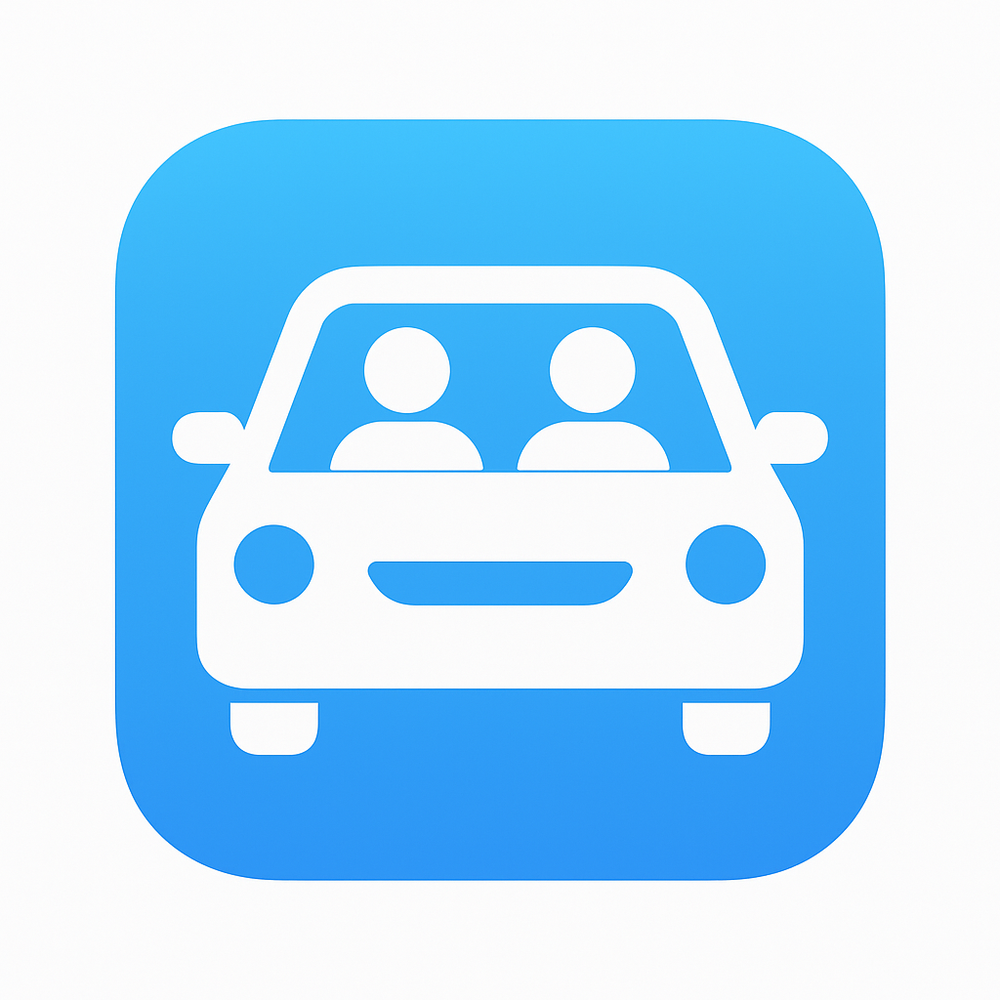

# 🚗 SchoolCarpool - iOS Carpool Matching App

> **Safe, Smart School Transport for Canberra Families**

SchoolCarpool is a comprehensive iOS application designed specifically for school transport communities in Canberra, ACT. The app connects families for safe, verified carpool arrangements with a focus on child safety, community trust, and route optimization.



## 🌟 Key Features

### 🛡️ Safety First
- **Background verification** system for all drivers
- **Real-time location sharing** during trips
- **Safety scoring** for routes and drivers
- **Emergency alert** system
- **Incident reporting** capabilities

### 👨‍👩‍👧‍👦 Family Matching
- **Smart matching algorithm** based on location, schedule, and preferences
- **School-specific** matching for Canberra schools
- **Flexible scheduling** with proposal system
- **Group formation** with up to 4 families per carpool

### 📱 Modern iOS Experience
- **SwiftUI** native interface
- **Apple Human Interface Guidelines** compliant
- **Dark mode** and accessibility support
- **Dynamic Type** for better readability
- **VoiceOver** compatibility

### 🗺️ Location & Navigation
- **Apple Maps** integration
- **Route optimization** for multiple pickups
- **School zone** compliance checking
- **Multi-modal transport** options (bus, walking, cycling)

### 💬 Communication
- **In-app group chat** for coordination
- **Schedule change proposals** with voting
- **Push notifications** for important updates
- **Emergency contact** integration

## 📋 Requirements

### For Mac Users (Full Installation)
- **macOS** 12.0 or later
- **Xcode** 14.0 or later
- **iOS Simulator** or physical iOS device
- **Apple Developer Account** (for device testing)

### For Non-Mac Users
- Access to **demo video** and **screenshots** (provided below)
- **Web browser** for viewing GitHub repository

## 🚀 Quick Installation (Mac Users)

### Step 1: Clone the Repository
```bash
git clone https://github.com/tatsering54/SchoolCarpoolMatcher.git
cd SchoolCarpoolMatcher
```

### Step 2: Open in Xcode
```bash
open SchoolCarpoolMatcher.xcodeproj
```

### Step 3: Configure Signing
1. Select the **SchoolCarpoolMatcher** project in Xcode
2. Go to **Signing & Capabilities**
3. Select your **Team** (Apple Developer Account)
4. Xcode will automatically configure the **Bundle Identifier**

### Step 4: Choose Target Device
- **iOS Simulator**: Select any iPhone simulator (iPhone 14 Pro recommended)
- **Physical Device**: Connect your iPhone and select it as the target

### Step 5: Build and Run
```bash
# In Xcode, press Cmd+R or click the Play button
# The app will build and launch on your selected device
```

### 🔧 Troubleshooting (Mac Users)

#### Common Issues:
1. **Signing Error**: Ensure you have a valid Apple Developer Account
2. **Simulator Not Loading**: Try resetting the simulator (Device → Erase All Content and Settings)
3. **Build Errors**: Clean build folder (Product → Clean Build Folder)

#### Location Services:
- When prompted, **allow location access** for full functionality
- The app works with mock data, so real location isn't required for demo

## 📺 Demo & Screenshots (For Non-Mac Users)

### 🎥 Demo Video
> **Coming Soon**: A comprehensive demo video showcasing all app features

**Video will include:**
- App walkthrough and navigation
- Family matching process
- Group formation and chat
- Safety features demonstration
- Location sharing and route planning
- Schedule coordination workflow

### 📸 Screenshots

#### Home Dashboard
> **Screenshot**: Main dashboard with safety metrics and quick actions

#### Family Matching
> **Screenshot**: Smart matching interface showing nearby families

#### Group Chat
> **Screenshot**: In-app messaging with safety-focused design

#### Route Planning
> **Screenshot**: Apple Maps integration with optimized routes

#### Safety Features
> **Screenshot**: Verification system and safety scoring

#### Schedule Coordination
> **Screenshot**: Proposal system for schedule changes

*Screenshots will be added to showcase the complete user experience*

## 🏗️ Project Structure

```
SchoolCarpoolMatcher/
├── 📱 SchoolCarpoolMatcherApp.swift    # Main app entry point
├── 🎨 ContentView.swift                # Root view controller
├── 📊 Data/
│   └── MockData.swift                  # Demo data for Canberra
├── 🏗️ Models/
│   ├── Family.swift                    # Family data model
│   ├── CarpoolGroup.swift             # Group management
│   ├── GroupMessage.swift             # Chat messages
│   └── VerificationModels.swift       # Safety verification
├── 🔧 Services/
│   ├── MatchingEngine.swift           # Smart matching algorithm
│   ├── LocationManager.swift          # Location services
│   ├── SafetyScoring.swift           # Safety assessment
│   ├── MessageService.swift          # Chat functionality
│   └── VerificationService.swift     # Background checks
├── 🎨 Views/
│   ├── HomeDashboardView.swift        # Main dashboard
│   ├── MatchingView.swift             # Family matching
│   ├── GroupChatView.swift            # Group messaging
│   ├── RouteMapView.swift             # Navigation
│   └── SafetyIncidentReportingView.swift
└── 🎯 Assets.xcassets/
    └── AppIcon.appiconset/            # Blue carpool icon (all sizes)
```

## 🎯 Target Audience

- **Parents** in Canberra seeking safe school transport
- **School communities** wanting organized carpool systems
- **Families** prioritizing child safety and verification
- **Busy parents** needing efficient coordination tools

## 🛡️ Privacy & Security

- **Location data** encrypted and only shared with group members
- **Background checks** processed securely
- **Child safety** prioritized in all features
- **GDPR compliant** data handling
- **No data** stored on external servers (demo version)

## 🌏 Canberra-Specific Features

- **Local school database** (Telopea Park, Campbell High, etc.)
- **ACT transport integration** with bus routes
- **Canberra suburb** recognition and mapping
- **Local safety** considerations and school zones
- **Australian privacy** law compliance

## 🚧 Development Status

- ✅ **Core Features**: Complete and functional
- ✅ **UI/UX**: Apple HIG compliant design
- ✅ **Safety Systems**: Verification and scoring implemented
- ✅ **Location Services**: Full integration with Apple Maps
- ✅ **Demo Data**: Realistic Canberra scenarios
- 🔄 **Backend Integration**: Future enhancement
- 🔄 **App Store Submission**: Ready for review process

## 🤝 Contributing

This project is designed for demonstration and educational purposes. For collaboration:

1. **Fork** the repository
2. **Create** a feature branch
3. **Commit** your changes with clear messages
4. **Push** to your branch
5. **Create** a Pull Request

## 📄 License

This project is created for educational and demonstration purposes. Please respect Apple's guidelines and ensure proper licensing for any commercial use.

## 📞 Contact & Support

- **GitHub**: [tatsering54](https://github.com/tatsering54)
- **Repository**: [SchoolCarpoolMatcher](https://github.com/tatsering54/SchoolCarpoolMatcher)

---

**Built with ❤️ for Canberra families prioritizing safe school transport**

> *SchoolCarpool - Where Safety Meets Community*
